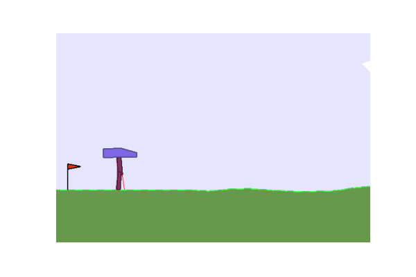

## Soft Actor-Critic for BipedalWalker-v3

This repository is a solution to JetBrains Autumn 2021 internship application task "Проекты в области Reinforcement
Learning
"

Example result with following parameters:

<table>
<tr><td>

Hyperparameter | Value  
--- | ---          
state_size | 24
action_size | 4
hidden_size | 256
tau | 0.002
gamma | 0.99
actor_lr | 3e-4
critic_lr | 3e-4
entropy_lr | 5e-5

</td><td>

Train Parameter | Value
--- | ---    
timesteps | 1 000 000
batch_size | 256
buffer_size | 1 000 000
start_train | 20 000
start_steps | 55 000
test_every | 5 000
test_count | 10
update_every | 8

</td></tr> </table>

